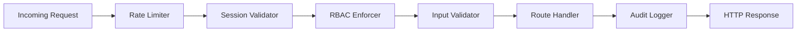

# SecureMesh API Architecture

This document defines the backend API architecture for SecureMesh (SIH26125), outlining principles, middleware, standard formats, and a detailed endpoint reference.

## 1. API Design Principles

SecureMesh adopts a strict, security-first API design philosophy:
- **RESTful Conventions**: Consistent use of HTTP verbs (GET, POST, PATCH) and resource-oriented URLs.
- **Fail-Closed Strategy**: Any failure in authorization, blockchain state verification, or internal service health immediately terminates the request and returns a structured error. No partial data is ever returned on security failures.
- **Consistent Error Format**: All API responses (success and error) follow a strictly typed schema, simplifying client-side error handling and ensuring no stack traces leak.
- **JSON Responses**: All payloads use `application/json`.
- **Strong Typing**: Input schemas and output formats are typed end-to-end utilizing Zod on the server and TypeScript interfaces on the client.

## 2. Middleware Architecture

SecureMesh implements a robust middleware pipeline to intercept and evaluate every request before it hits the route handler.



### 2.1 Middleware Layers Detail
- **Rate Limiter**: Limits the number of requests per IP/User to mitigate DoS and brute-force attacks.
- **Session Validator**: Extracts and validates the session JWT from the HTTP-only cookie.
- **RBAC Enforcer**: Retrieves the user's role and checks it against the endpoint's required permissions.
- **Input Validator**: Uses Zod to strictly validate `req.body`, `req.query`, and `req.params`. Any mismatch returns a 400 Validation Error.
- **Route Handler**: Executes the core business logic (DB queries, blockchain reads/writes, KMS operations).
- **Audit Logger**: Asynchronously records the outcome (success or failure) to the secure audit trail.

## 3. Authentication Middleware
SecureMesh relies on a multi-step authentication process:
1. **Wallet Signature Verification**: Validates a SIWE (Sign-In with Ethereum) style message to ensure the caller controls the corresponding EVM address.
2. **JWT Session Token Validation**: Once authenticated, the server issues an HTTP-only JWT. The middleware validates the token signature, expiry, and not-before claims on subsequent requests.
3. **Session Binding Verification**: Ensures the JWT session correlates with an active, unrevoked DID in the Chain-1 Identity Registry.

## 4. Authorization Middleware
1. **RBAC Check**: Confirms the authenticated user holds a role with the required permission (e.g., `decrypt_assets`, `manage_users`).
2. **Contextual Policy Evaluation**: Certain high-value endpoints evaluate dynamic contexts such as time-of-day, IP geolocation, and active device policies before granting access.

## 5. Standard Response Format

All API responses follow this consistent envelope:

```json
{
  "success": true,
  "data": { ... },
  "error": null,
  "meta": {
    "timestamp": "2026-09-03T12:00:00Z",
    "requestId": "req_123456789"
  }
}
```
On failure, `success` is `false`, `data` is `null`, and `error` contains:
```json
"error": {
  "code": "ERR_CODE",
  "message": "Human readable description."
}
```

## 6. Standard Error Codes

| Error Code | HTTP Status | Description |
|---|---|---|
| `AUTH_REQUIRED` | 401 | Missing, invalid, or expired session token. |
| `INVALID_SESSION` | 401 | Session token cryptographically invalid or manipulated. |
| `PERMISSION_DENIED` | 403 | User role lacks required permission for this action. |
| `ACCESS_EXPIRED` | 403 | Temporary access token or session has expired. |
| `RESOURCE_NOT_FOUND` | 404 | Requested entity does not exist. |
| `VALIDATION_ERROR` | 400 | Request body/parameters failed Zod schema validation. |
| `RATE_LIMITED` | 429 | Too many requests from this IP or User. |
| `INTERNAL_ERROR` | 500 | Unexpected server exception. |
| `BLOCKCHAIN_UNAVAILABLE` | 503 | Unable to query or write to Chain-1 or Chain-2 RPCs. |
| `KMS_UNAVAILABLE` | 503 | KMS service or master key unreachable. |

## 7. Detailed API Endpoint Reference

### Authentication
#### `POST /api/auth/wallet`
- **Description**: Authenticates user via wallet signature.
- **Required Role**: None
- **Request Body**: `{ message: string, signature: string, address: string }`
- **Response**: `{ sessionToken: string, userProfile: UserProfile }`
- **Error Cases**: `VALIDATION_ERROR`, `AUTH_REQUIRED` (invalid sig)
- **Audit Event**: `LOGIN_SUCCESS` / `LOGIN_FAILED`

#### `POST /api/auth/logout`
- **Description**: Revokes active session.
- **Required Role**: Authenticated User
- **Response**: `{}`
- **Audit Event**: `LOGOUT`

#### `GET /api/auth/session`
- **Description**: Returns current session info.
- **Required Role**: Authenticated User
- **Response**: `{ user: UserProfile, expiresAt: string }`

---

### Identity
#### `GET /api/identity`
- **Description**: List identities.
- **Required Role**: `ADMIN`
- **Response**: `{ identities: Identity[] }`

#### `GET /api/identity/[did]`
- **Description**: Get identity details.
- **Required Role**: Authenticated User
- **Response**: `{ identity: Identity }`

#### `POST /api/identity/register`
- **Description**: Register a new DID.
- **Required Role**: `ADMIN`
- **Request Body**: `{ address: string, displayName: string, role: string }`
- **Response**: `{ did: string, status: string }`
- **Blockchain**: Writes to Chain-1 `IdentityRegistry.sol`
- **Audit Event**: `IDENTITY_REGISTERED`

#### `PATCH /api/identity/[did]/status`
- **Description**: Update identity status.
- **Required Role**: `ADMIN`
- **Request Body**: `{ status: 'ACTIVE' | 'SUSPENDED' | 'REVOKED' }`
- **Response**: `{ success: boolean }`
- **Blockchain**: Writes to Chain-1 `IdentityRegistry.sol`
- **Audit Event**: `IDENTITY_STATUS_UPDATED`

---

### Assets
#### `GET /api/assets`
- **Description**: List assets (filtered by user's role and assignments).
- **Required Role**: Authenticated User
- **Response**: `{ assets: Asset[] }`

#### `GET /api/assets/[id]`
- **Description**: Get asset details.
- **Required Role**: Authenticated User (must have view access)
- **Response**: `{ asset: Asset }`

#### `POST /api/assets`
- **Description**: Register a new asset metadata.
- **Required Role**: `ADMIN`, `MANAGER`
- **Request Body**: `{ name: string, description: string, classification: string, department: string }`
- **Response**: `{ assetId: string }`
- **Blockchain**: Writes to Chain-1 `AssetRegistry.sol`

#### `POST /api/assets/[id]/encrypt`
- **Description**: Encrypts and stores asset content.
- **Required Role**: `ADMIN`, `MANAGER` (must be asset owner)
- **Request Body**: `FormData` containing file.
- **Response**: `{ success: true, keyVersion: number }`
- **Audit Event**: `ASSET_ENCRYPTED`

#### `POST /api/assets/[id]/decrypt`
- **Description**: Decrypts asset.
- **Required Role**: Authenticated User
- **Request Body**: `{ tempToken: string }` (The short-lived 5-min JWT)
- **Response**: Binary stream over TLS.
- **Error Cases**: `ACCESS_EXPIRED`, `PERMISSION_DENIED`, `KMS_UNAVAILABLE`
- **Audit Event**: `ASSET_DECRYPTED`

#### `PATCH /api/assets/[id]`
- **Description**: Update asset metadata.
- **Required Role**: `ADMIN`, `MANAGER`

#### `POST /api/assets/[id]/assign`
- **Description**: Assign asset to user.
- **Required Role**: `ADMIN`, `MANAGER`
- **Request Body**: `{ targetDid: string, permissions: string[] }`
- **Blockchain**: Writes to Chain-1 `AssetRegistry.sol`

#### `POST /api/assets/[id]/revoke`
- **Description**: Revoke asset assignment.
- **Required Role**: `ADMIN`, `MANAGER`

#### `POST /api/assets/[id]/transfer`
- **Description**: Transfer asset ownership.
- **Required Role**: `ADMIN`, `MANAGER`

---

### Access
#### `POST /api/access/request` (CRITICAL FLOW)
- **Description**: Creates a request to access/decrypt an asset.
- **Required Role**: Authenticated User
- **Request Body**: `{ asset_id: string, operation: 'READ', purpose: string }`
- **Response**: `{ tempToken: string, expiresAt: string }` (On auto-approve) or `{ status: 'PENDING' }` (If manual approval needed).
- **Full Flow Execution**:
  1. Validate HTTP-only JWT session.
  2. Verify user's DID is `ACTIVE` on Chain-1 `IdentityRegistry`.
  3. Check RBAC permissions on Chain-1 `RBACManager`.
  4. Evaluate contextual policy (time, device).
  5. Verify asset assignment on Chain-1 `AssetRegistry`.
  6. Request key authorization on Chain-2 `KeyPolicyManager`.
  7. Verify key is active on Chain-2 `KeyLifecycle`.
  8. Record authorization event on Chain-2 `DecryptionAuth`.
  9. Server-side KMS generates a temporary decryption JWT token (5-min TTL).
  10. Return temp token to client.
- **Fail-Closed**: ANY failure in steps 1-8 immediately aborts the flow, logs a denial audit event, and returns a 403 `PERMISSION_DENIED` or appropriate error.

#### `POST /api/access/approve`
- **Description**: Approve a pending manual access request.
- **Required Role**: `ADMIN`, `MANAGER`
- **Request Body**: `{ requestId: string }`

#### `GET /api/access/[id]`
- **Description**: Get access request details.

---

### Key Management
#### `GET /api/keys`
- **Description**: List encryption keys.
- **Required Role**: `ADMIN`

#### `GET /api/keys/[id]`
- **Description**: Get key metadata.

#### `POST /api/keys/rotate`
- **Description**: Rotate the Data Encryption Key (DEK) for an asset.
- **Required Role**: `ADMIN`
- **Request Body**: `{ asset_id: string }`
- **Blockchain**: Updates Chain-2 `KeyLifecycle.sol`

#### `POST /api/keys/revoke`
- **Description**: Revoke a key immediately.
- **Required Role**: `ADMIN`
- **Request Body**: `{ key_id: string, reason: string }`
- **Blockchain**: Updates Chain-2 `KeyLifecycle.sol`

#### `GET /api/keys/policies`
- **Description**: List key authorization policies.

---

### Audit
#### `GET /api/audit`
- **Description**: Query the secure audit log.
- **Required Role**: `ADMIN`, `AUDITOR`, `SECURITY_ANALYST`
- **Query Params**: `page, limit, event_type, actor, target, startDate, endDate`

#### `GET /api/audit/verify`
- **Description**: Verify the cryptographic integrity of the hash chain.
- **Required Role**: `ADMIN`, `AUDITOR`
- **Query Params**: `{ start_id: string, end_id: string }`
- **Blockchain**: Compares computed Merkle root with Chain-1 `AuditAnchor.sol`.

#### `GET /api/audit/export`
- **Description**: Export audit log as CSV/JSON.
- **Required Role**: `ADMIN`, `AUDITOR`

---

### Security / Sentinel
#### `POST /api/sentinel/scan`
- **Description**: Trigger automated security validation suite.
- **Required Role**: `ADMIN`, `SECURITY_ANALYST`
- **Request Body**: `{ scan_type: 'FULL' | 'TARGETED' }`

#### `GET /api/sentinel/findings`
- **Description**: List security findings.
- **Required Role**: `ADMIN`, `AUDITOR`, `SECURITY_ANALYST`

#### `GET /api/sentinel/findings/[id]`
- **Description**: Details of a specific finding.

#### `PATCH /api/sentinel/findings/[id]`
- **Description**: Update finding status (e.g. mark RESOLVED).
- **Required Role**: `SECURITY_ANALYST`

#### `GET /api/sentinel/scans`
- **Description**: History of Sentinel scans.

#### `GET /api/sentinel/posture`
- **Description**: Aggregate security posture metrics.

---

### Blockchain
#### `GET /api/blockchain/status`
- **Description**: Health status of Chain-1 and Chain-2 RPCs.
- **Required Role**: Authenticated User

#### `GET /api/blockchain/transactions`
- **Description**: List recent transactions submitted by the backend.

#### `GET /api/blockchain/contracts`
- **Description**: Get deployed contract addresses and ABIs for client-side interactions.

---

### Dashboard
#### `GET /api/dashboard/metrics`
- **Description**: Aggregated system metrics computed dynamically from the DB and blockchain state.
- **Response Data Includes**:
  `totalUsers, activeUsers, totalAssets, activeAssignments, pendingRequests, deniedRequests, activeKeySessions, expiringAccess, securityFindings, criticalIncidents, blockchainHealth, kmsHealth`

---

### Emergency
#### `POST /api/emergency/break-glass`
- **Description**: Emergency bypass access request.
- **Required Role**: `ADMIN`
- **Request Body**: `{ asset_id: string, justification: string }`
- **Behavior**: Bypasses standard policy checks. Emits a CRITICAL audit event and alerts administrators. Heavily logged.

## 8. Cross-Cutting Concerns

- **Rate Limiting Strategy**: Global limit of 100 req/min per IP. Sensitive endpoints (`/api/auth/wallet`, `/api/access/request`, `/api/assets/[id]/decrypt`) enforce stricter limits (e.g., 5-10 req/min) to prevent abuse and brute forcing.
- **Input Validation**: All incoming requests are strictly validated using Zod schemas matching the TypeScript interfaces. Unrecognized fields are stripped.
- **CORS Configuration**: Explicitly restricts origins to the defined frontend URL (`NEXT_PUBLIC_APP_URL`). Blocks unknown origins.
- **API Versioning Strategy**: Standardized `/api/v1/...` routing structure for future extensibility and breaking changes, though prototypes may omit the `v1` prefix for brevity.
- **WebSocket Events**: (Optional) Provides real-time feeds for Audit logs (`new_audit_event`) and Blockchain transaction statuses to the dashboard.
