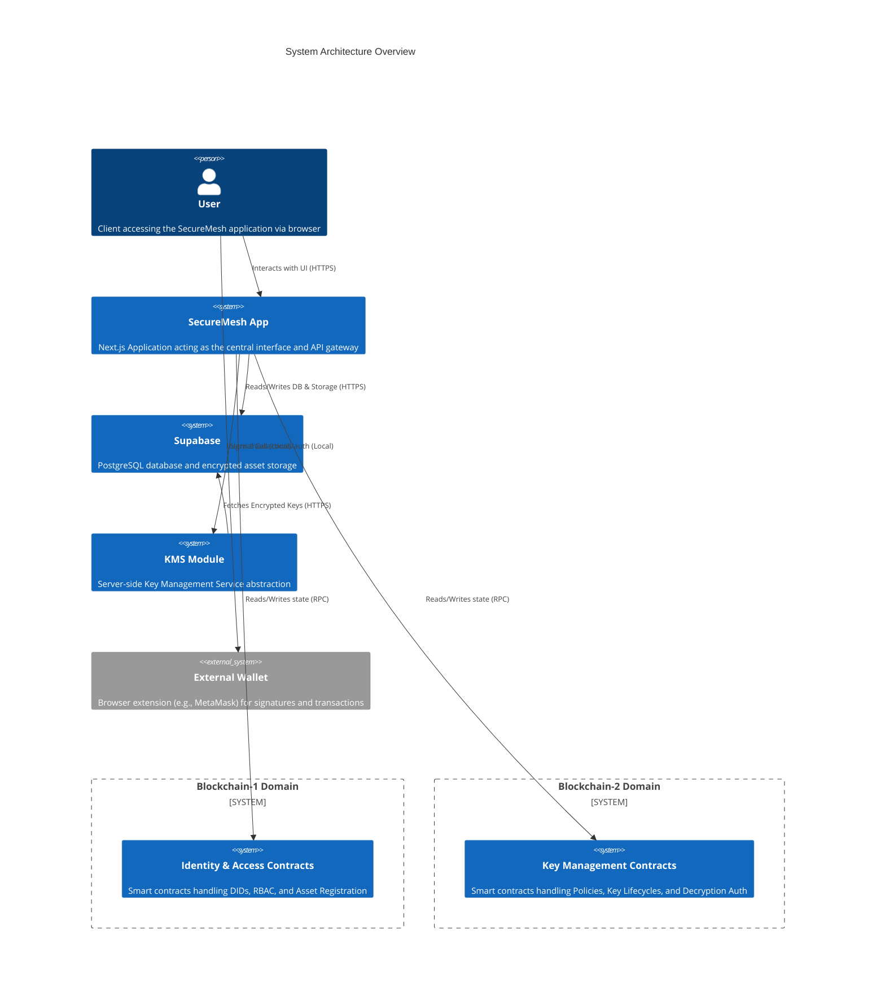
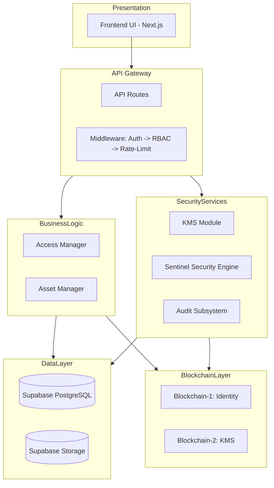
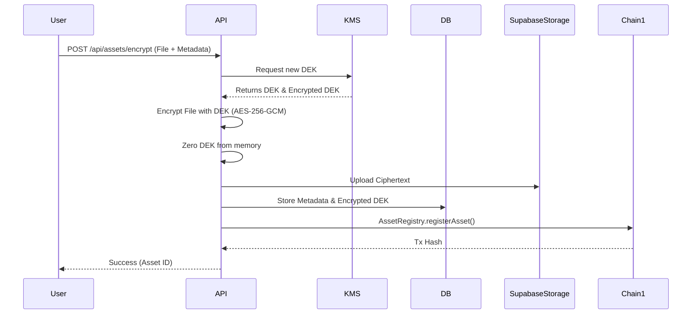
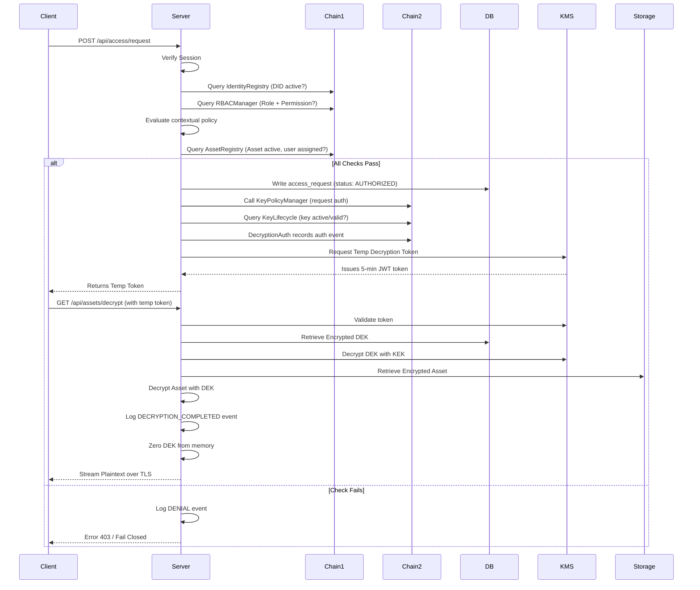
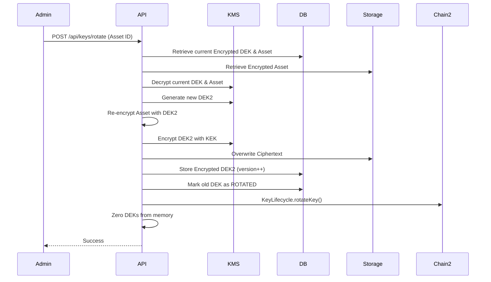
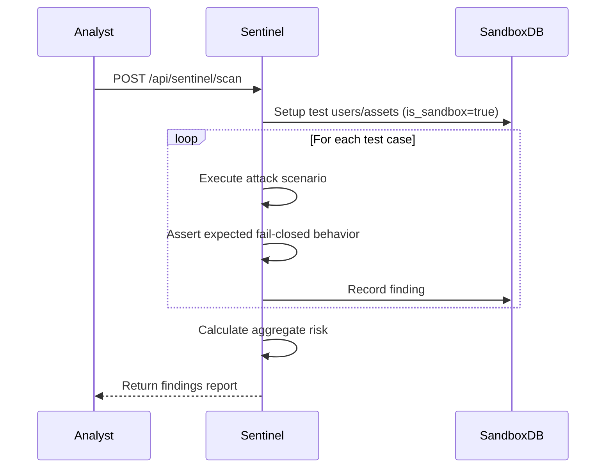

# SecureMesh System Architecture

## 1. System Architecture Overview

SecureMesh is designed as a decentralized identity and secure digital asset access platform, implementing a robust zero-trust architecture. 



## 2. Architectural Principles

- **Zero-Trust**: No implicit trust is granted based on network location or past sessions. Every access request is fully authenticated and authorized.
- **Defense-in-Depth**: Multiple layers of security checks (Application, Database RLS, Blockchain Smart Contracts) ensure that the failure of one mechanism does not compromise the system.
- **Fail-Closed**: In the event of an error, exception, or timeout at any stage of authorization or decryption, the system defaults to denying access.
- **Separation of Concerns**: Identity management and key management are logically separated into two distinct blockchain domains.
- **Least Privilege**: Users are granted the minimum level of access required to perform their tasks, enforced by RBAC.
- **AUTHORIZATION ≠ DECRYPTION**: A critical principle of SecureMesh. Having permission to access an asset (authorization) is mathematically distinct from the ability to decrypt it. Authorization happens via smart contracts; decryption requires the transient synthesis of keys via the KMS upon successful authorization.

## 3. Layer Architecture



## 4. Component Architecture

### 4.1 Frontend
- **Framework**: Next.js App Router (React)
- **Routing**: Organized using route groups (e.g., `(public)`, `(protected)`) for clean separation of authenticated vs. unauthenticated logic.
- **Component Hierarchy**: Modular components adhering to atomic design, utilizing `shadcn/ui` for consistent and accessible components.
- **State Management**: Zustand for global state management (user sessions, current active wallet, theme), minimizing unnecessary re-renders.

### 4.2 API Layer
- **Implementation**: Next.js API routes handling backend operations.
- **Middleware Chain**: Incoming requests pass through a strict middleware chain:
  1. `Auth`: Verifies the session JWT.
  2. `RBAC`: Validates the user's role against the endpoint's required permissions.
  3. `Rate-Limit`: Prevents abuse (e.g., brute-forcing APIs).
  4. `Handler`: The actual business logic execution.

### 4.3 Blockchain-1: Identity & Access Domain
Manages who a user is and what they are allowed to do.
- **IdentityRegistry.sol**: Registers Decentralized Identifiers (DIDs). Stores mapping of address, DID string, name hash, role reference, and status. Emits identity lifecycle events.
- **RBACManager.sol**: Manages roles and permissions. Assigns roles (defined as `uint8` enums) to DIDs and checks permissions.
- **AssetRegistry.sol**: Registers the existence of an asset on-chain. Manages asset assignments to users, ownership transfers, and revocations.
- **AuditAnchor.sol**: Stores periodic Merkle roots of off-chain audit events, providing an immutable anchor for tamper verification.

### 4.4 Blockchain-2: Key Management Domain
Manages the cryptographic keys required to access assets.
- **KeyPolicyManager.sol**: Creates, updates, evaluates, and deactivates policies associated with keys.
- **KeyLifecycle.sol**: Registers key metadata (not the key material), handles key rotation versioning, revokes keys, and provides key status.
- **DecryptionAuth.sol**: Records the final authorization events, logging successful completions or denials of decryption requests.

### 4.5 KMS Module
A server-side Key Management Service abstraction built in TypeScript.
- **Architecture**: Envelope encryption architecture. The KMS module runs *only* in server-side Next.js API routes.
- **Key Hierarchy**:
  ```mermaid
  graph TD
      MK[Master Key - Env Var] --> KEK[Key Encryption Key - per domain]
      KEK --> DEK1[Data Encryption Key - Asset 1]
      KEK --> DEK2[Data Encryption Key - Asset 2]
  ```
- **Temporary Token Flow**: When authorization succeeds, the KMS issues a short-lived (5-minute TTL) JWT decryption token containing user DID, asset ID, operation, nonces, and chain authorization references. This token is used to fetch the plaintext securely.

### 4.6 Sentinel Security Engine
A deterministic security test runner for validating system invariants.
- **Architecture**: 
  - **Test Registry**: Maintains predefined security test cases (e.g., privilege escalation, expired token replay).
  - **Sandbox Manager**: Isolates test execution using specific database flags (`is_sandbox=true`).
  - **Executor**: Runs test cases (sets preconditions -> attacks -> asserts failure).
  - **Reporter**: Records findings to the `security_findings` table.
  - **Responder**: Triggers automated responses (alert, restrict) based on severity.

### 4.7 Audit Subsystem
Provides tamper-evident logging of all system actions.
- **Mechanism**: Every event is stored in the DB with a `prev_hash`, creating a continuous SHA-256 hash chain.
- **Merkle Anchoring**: Periodically, a Merkle root of a batch of event hashes is computed and anchored to the `AuditAnchor` smart contract on Blockchain-1.
- **Verification**: Dedicated API endpoint recalculates the hash chain and verifies against the on-chain root to detect tampering.

## 5. Cross-Cutting Concerns
- **Error Handling**: Standardized error response formats. All unexpected errors result in a fail-closed state.
- **Logging**: Comprehensive structured logging for all API operations, with sensitive data redacted.
- **Telemetry**: Aggregated metrics tracked in the database for the dashboard.
- **Environment Configuration**: Strict validation of environment variables on startup. The app fails to boot if critical secrets (like the KMS Master Key) are missing.

## 6. Data Flow Diagrams

### 6.1 Asset Registration & Encryption Flow


### 6.2 Access Request & Decryption Flow (Canonical)


### 6.3 Key Rotation Flow


### 6.4 Security Scan Flow (Sentinel)


## 7. Integration Architecture
The architecture heavily relies on the Next.js API layer acting as the secure orchestrator:
- **Frontend ↔ API**: Standard HTTP REST and Server Actions using secure session cookies.
- **API ↔ Blockchain**: Uses `ethers.js` / `viem` via RPC to read state and submit transactions. Uses deployer keys carefully managed on the server for automated txs where applicable, or prompts client wallet for user actions.
- **API ↔ DB**: Supabase client (`@supabase/supabase-js`) executing queries over HTTPS.
- **API ↔ KMS**: Internal synchronous TypeScript calls. Key material never leaves the Node.js process boundaries.

## 8. Deployment Architecture
For detailed deployment configurations, infrastructure setup, and environment variables, refer to the [DEPLOYMENT_ARCHITECTURE.md](./DEPLOYMENT_ARCHITECTURE.md) document.

## 9. Honest Prototype Compromises
As an SIH prototype, the following deliberate architectural compromises were made and must be addressed for a production release:

1. **Both chains on same testnet**: Chain-1 and Chain-2 are deployed to the same EVM testnet (Sepolia) using namespaces. Production would physically separate them onto distinct networks or L2s.
2. **Software KMS**: We use a TypeScript software KMS abstraction. Production requires an HSM-backed service (e.g., AWS KMS, Azure Key Vault).
3. **Gas paid by deployer wallets**: The backend subsidizes gas for automated prototype functions. Production requires meta-transactions (EIP-2771) or robust gas stations.
4. **No formal DID resolution**: We use simplified `did:securemesh:<address>` strings. Production requires a full W3C compliant DID resolver infrastructure.
5. **Sentinel sandbox shares DB**: Sandbox records share the same DB instance marked with a flag. Production demands a physically isolated staging/testing database environment.
6. **No hardware device binding**: Contextual auth lacks hardware attestation. Production requires FIDO2/WebAuthn for strict device binding.
7. **Single Vercel region**: Deployed to a single region. Production requires multi-region deployments with edge caching.
8. **Testnet blockchain**: Uses a public testnet. Production would likely utilize a private consortium chain or a dedicated sovereign L2 rollup for privacy and throughput.
