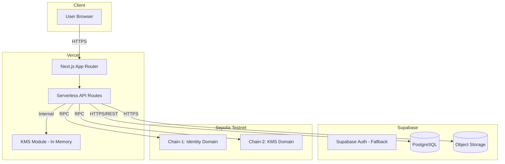

# SecureMesh Deployment Architecture

## 1. Deployment Overview

SecureMesh uses a modern, serverless deployment stack tailored for the SIH prototype.



## 2. Vercel Configuration
- **Platform**: Vercel handles the Next.js frontend and serverless API functions.
- **Serverless Regions**: Configured for `bom1` (Mumbai) to minimize latency for Indian users, or standard `iad1` depending on availability.
- **Build Command**: Standard `next build`.
- **Environment Variables**: Integrated securely in the Vercel dashboard.

## 3. Supabase Configuration
- **Project Setup**: Provisioned via Supabase dashboard.
- **Database Schema**: Migrations managed and applied via the Supabase CLI (`supabase/migrations`).
- **Storage Buckets**: A private bucket named `encrypted-assets` is provisioned.
- **RLS Policies**: Row Level Security is strictly enforced. The API uses a service role key only for backend-authenticated, secure operations where the user's scope is explicitly verified in logic.

## 4. Blockchain Deployment
- **Network**: Ethereum Sepolia Testnet.
- **Framework**: Hardhat.
- **Deployer Wallet Management**: Two separate deployment accounts are maintained to simulate the physical separation of Chain-1 and Chain-2.
- **Scripts**: Automated deploy scripts (`scripts/deploy-chain1.ts` and `scripts/deploy-chain2.ts`).
- **Verification**: Contracts are verified on Etherscan for transparency during the SIH evaluation.

## 5. Environment Variable Reference

| Variable Name | Required | Description | Used In | Example Format |
|---|---|---|---|---|
| `NEXT_PUBLIC_SUPABASE_URL` | Yes | API URL for Supabase | Frontend/Backend | `https://xxxx.supabase.co` |
| `NEXT_PUBLIC_SUPABASE_ANON_KEY` | Yes | Anon key for Supabase client | Frontend | `eyJh...` |
| `SUPABASE_SERVICE_ROLE_KEY` | Yes | Service key for backend operations | Backend | `eyJh...` |
| `NEXT_PUBLIC_CHAIN1_RPC_URL` | Yes | RPC endpoint for Identity domain | Frontend/Backend | `https://eth-sepolia...` |
| `NEXT_PUBLIC_CHAIN2_RPC_URL` | Yes | RPC endpoint for KMS domain | Frontend/Backend | `https://eth-sepolia...` |
| `CHAIN1_DEPLOYER_PRIVATE_KEY` | Yes | Backend wallet for Chain-1 txs | Backend | `0x123...` |
| `CHAIN2_DEPLOYER_PRIVATE_KEY` | Yes | Backend wallet for Chain-2 txs | Backend | `0x456...` |
| `NEXT_PUBLIC_IDENTITY_REGISTRY_ADDRESS` | Yes | Contract address | Frontend/Backend | `0xabc...` |
| `NEXT_PUBLIC_RBAC_MANAGER_ADDRESS` | Yes | Contract address | Frontend/Backend | `0xabc...` |
| `NEXT_PUBLIC_ASSET_REGISTRY_ADDRESS` | Yes | Contract address | Frontend/Backend | `0xabc...` |
| `NEXT_PUBLIC_AUDIT_ANCHOR_ADDRESS` | Yes | Contract address | Frontend/Backend | `0xabc...` |
| `NEXT_PUBLIC_KEY_POLICY_MANAGER_ADDRESS`| Yes | Contract address | Frontend/Backend | `0xabc...` |
| `NEXT_PUBLIC_KEY_LIFECYCLE_ADDRESS` | Yes | Contract address | Frontend/Backend | `0xabc...` |
| `NEXT_PUBLIC_DECRYPTION_AUTH_ADDRESS` | Yes | Contract address | Frontend/Backend | `0xabc...` |
| `SECUREMESH_KMS_MASTER_KEY` | Yes | 256-bit AES master key (hex) | Backend (KMS) | `abcdef...` |
| `SECUREMESH_KEK_SALT` | Yes | Salt for deriving KEKs | Backend (KMS) | `random_string` |
| `JWT_SECRET` | Yes | Secret for signing auth tokens | Backend | `super_secret` |
| `SESSION_SECRET` | Yes | Secret for session cookies | Backend | `session_secret` |
| `NEXT_PUBLIC_APP_URL` | Yes | Base URL of the app | Frontend/Backend | `http://localhost:3000` |
| `NODE_ENV` | Optional| Environment mode | App | `development` |

## 6. .env.example

```env
# Supabase
NEXT_PUBLIC_SUPABASE_URL=https://your-project.supabase.co
NEXT_PUBLIC_SUPABASE_ANON_KEY=your-anon-key
SUPABASE_SERVICE_ROLE_KEY=your-service-key

# Blockchain
NEXT_PUBLIC_CHAIN1_RPC_URL=https://sepolia.infura.io/v3/YOUR_KEY
NEXT_PUBLIC_CHAIN2_RPC_URL=https://sepolia.infura.io/v3/YOUR_KEY
CHAIN1_DEPLOYER_PRIVATE_KEY=0x...
CHAIN2_DEPLOYER_PRIVATE_KEY=0x...

# Contracts
NEXT_PUBLIC_IDENTITY_REGISTRY_ADDRESS=0x...
NEXT_PUBLIC_RBAC_MANAGER_ADDRESS=0x...
NEXT_PUBLIC_ASSET_REGISTRY_ADDRESS=0x...
NEXT_PUBLIC_AUDIT_ANCHOR_ADDRESS=0x...
NEXT_PUBLIC_KEY_POLICY_MANAGER_ADDRESS=0x...
NEXT_PUBLIC_KEY_LIFECYCLE_ADDRESS=0x...
NEXT_PUBLIC_DECRYPTION_AUTH_ADDRESS=0x...

# KMS
SECUREMESH_KMS_MASTER_KEY=your_256_bit_hex_key
SECUREMESH_KEK_SALT=your_random_salt

# Auth
JWT_SECRET=your_jwt_secret
SESSION_SECRET=your_session_secret

# App
NEXT_PUBLIC_APP_URL=http://localhost:3000
NODE_ENV=development
```

## 7. CI/CD Pipeline
- **Provider**: GitHub Actions.
- **Workflow**:
  1. **Lint**: Run ESLint and Prettier.
  2. **Test**: Execute Vitest for library components and Hardhat tests for smart contracts.
  3. **Build**: Verify the Next.js app builds successfully.
  4. **Deploy Contracts (Manual/Conditional)**: On specific tags, deploy smart contracts.
  5. **Deploy Vercel**: Push to Vercel preview/production environments.

## 8. Domain & DNS
- **DNS**: Configured in Vercel to route a custom domain (e.g., `securemesh.app`) to the Vercel edge network.

## 9. Monitoring & Observability
- **Vercel Analytics**: Out-of-the-box tracking for web vitals and API route latency.
- **Supabase Dashboard**: Monitoring for database query performance and storage usage.
- **Blockchain Explorer**: Etherscan (Sepolia) used for observing contract interactions and verifying event emissions.

## 10. Disaster Recovery
- **Database**: Supabase automatic daily backups (Point-in-Time Recovery enabled for production).
- **Contracts**: Smart contract state is immutable; recovery relies on frontend configuration updates pointing to new addresses in case of a required migration.
- **Secrets**: If `SECUREMESH_KMS_MASTER_KEY` is compromised, all data must be re-encrypted. Strict rotation policies for environment variables are required.

## 11. Production Readiness Checklist
Before migrating from the SIH prototype to a real production environment, the following must be implemented:
- [ ] **HSM KMS**: Replace the software KMS with AWS KMS, Azure Key Vault, or an on-premise HSM.
- [ ] **Private Blockchain / AppChain**: Move off public testnets to a private Hyperledger Besu consortium network, or a sovereign L2 rollup for privacy and predictable throughput.
- [ ] **Multi-Region**: Deploy the application across multiple regions for high availability.
- [ ] **WAF & DDoS Protection**: Implement Cloudflare or AWS WAF.
- [ ] **Compliance Audits**: Complete SOC2, ISO27001, and independent smart contract audits.
- [ ] **Gas Abstraction**: Implement gas station networks (e.g., Biconomy) or EIP-2771 meta-transactions so users don't need ETH.
- [ ] **Strong Auth Binding**: Integrate FIDO2 / WebAuthn for hardware-bound sessions.

## 12. Cost Estimation
- **Prototype (Current)**:
  - Vercel: Free Tier
  - Supabase: Free Tier
  - Blockchain (Sepolia): Free (testnet ETH)
  - Total: $0/month
- **Production (Estimated Base)**:
  - Managed Next.js / AWS: ~$100-300/mo
  - Managed PostgreSQL + Storage: ~$150-400/mo
  - Cloud HSM / KMS: ~$400+/mo
  - Private Blockchain Nodes: ~$500+/mo
  - Total estimated starting cost: ~$1,200+/month
