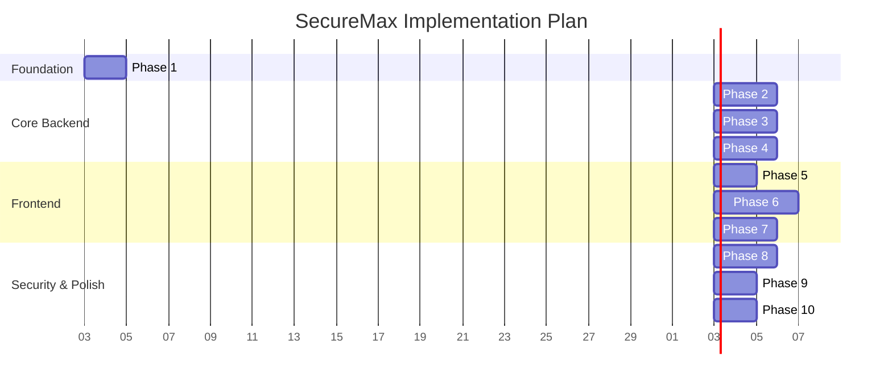

# SecureMax - Implementation Plan

## Overview & Strategy
This plan outlines a phased approach to building the SecureMax prototype for SIH26125. The strategy prioritizes establishing the core cryptographic and blockchain foundations before building the UI, ensuring the critical security properties are solid.

## Repository Structure
```text
SecureMax/
├── docs/                         # Architecture documents
├── src/
│   ├── app/                      # Next.js App Router
│   │   ├── (public)/             # Landing, auth
│   │   ├── (protected)/          # Authenticated routes (dashboard, assets, etc.)
│   │   └── api/                  # API Layer (auth, assets, keys, audit, sentinel)
│   ├── components/               # React components (ui, layout, domain-specific)
│   ├── lib/                      # Core logic (blockchain, crypto, kms, db, sentinel)
│   ├── hooks/                    # Custom React hooks
│   ├── stores/                   # State management
│   └── types/                    # TypeScript definitions
├── contracts/                    # Solidity smart contracts
│   ├── chain1/                   # Identity, RBAC, Assets, Audit
│   ├── chain2/                   # Key Policy, Lifecycle, Auth
│   └── interfaces/
├── test/                         # Test suites
├── scripts/                      # Deployment & utility scripts
├── supabase/                     # Database migrations & config
├── .env.example
├── hardhat.config.ts
├── package.json
└── tsconfig.json
```

## Phase 1: Foundation (1-2 days)
**Objectives:** Setup project scaffolding, database schema, and UI foundation.
**Deliverables:**
- Next.js project initialized with TypeScript and Tailwind.
- shadcn/ui configured.
- Supabase project created and schema migrations written.
- Environment variables configured.
**Dependencies:** None.
**Verification:** Project builds successfully; DB tables accessible via Supabase studio.

## Phase 2: Core Library Implementation (Est. 4 Days)
- [ ] **Database Client:** Typed Supabase client generation.
- [ ] **Authentication Services:** SIWE validation, session management.
  - *Hardening:* Implement strict nonce lifecycle (generate, store in HTTP-only cookie, destroy on use).
- [ ] **Cryptographic Services:** AES-256-GCM and HKDF utilities.
  - *Hardening:* Enforce `import "server-only"` across all crypto modules.
- [ ] **KMS Module:** Envelope encryption, DEK management.
  - *Hardening:* Implement Cryptographic Binding for Temp Tokens (hash of Session ID + IP).
- [ ] **Audit Services:** Hash-chain logger and Merkle tree generator.

## Phase 3: Smart Contract Development (Est. 5 Days)
- [ ] **Chain-1 Contracts:** IdentityRegistry, RBACManager, AssetRegistry, AuditAnchor.
- [ ] **Chain-2 Contracts:** KeyPolicyManager, KeyLifecycle, DecryptionAuth.
- [ ] **Testing:** Comprehensive Hardhat tests for all logic.
- [ ] **Deployment:** Scripts for deploying to Sepolia testnets.

## Phase 4: API & Integration Layer (Est. 5 Days)
- [ ] **Middleware:** Auth and RBAC middleware for API routes.
  - *Hardening:* Propagate authenticated JWT to Supabase Client (No global Service Role usage).
  - *Hardening:* Implement 5MB payload limits to prevent Vercel OOM DoS.
- [ ] **Asset API:** Registration, assignment, and retrieval endpoints.
  - *Hardening:* Utilize Node.js Streams for decryption instead of in-memory buffers.
- [ ] **KMS API:** Endpoints for Temp Token issuance and key rotation.
  - *Hardening:* Enforce cross-chain verification (Wait for Chain-2 receipt) before issuing Temp Tokens.
  - *Hardening:* Query RPC with `blockTag: 'latest'` and `no-store` to prevent stale authorization.
- [ ] **Audit API:** Endpoints for logging and querying the hash chain.
**Deliverables:**
- Auth routes (`/api/auth/*`).
- Asset CRUD and encryption routes (`/api/assets/*`).
- Access flow endpoints (`/api/access/*`).
- Key management endpoints.
- Audit & Sentinel endpoints.
**Dependencies:** Phase 2, Phase 3.
**Verification:** API integration tests pass; fail-closed behavior verified.

## Phase 5: Frontend - Auth & Layout (1-2 days)
**Objectives:** Establish user session management and application shell.
**Deliverables:**
- Wallet connection UI (SIWE flow).
- App layout with sidebar navigation.
- Route protection (middleware).
**Dependencies:** Phase 4.
**Verification:** Users can sign in with wallet and see role-appropriate menus.

## Phase 6: Frontend - Core Features (3-4 days)
**Objectives:** Build main user and admin workflows.
**Deliverables:**
- Role-based dashboards (Admin vs User).
- Asset management UI (upload, encrypt).
- Access request flow UI.
- Key management UI.
**Dependencies:** Phase 5.
**Verification:** End-to-end asset upload, access request, and decryption flow works in UI.

## Phase 7: Frontend - Security & Audit (2-3 days)
**Objectives:** Expose security and monitoring features.
**Deliverables:**
- Audit trail viewer with hash chain verification UI.
- Sentinel dashboard (findings and scans).
- Blockchain status monitoring.
**Dependencies:** Phase 6.
**Verification:** Audit logs visible and verifiable; Sentinel scans can be triggered from UI.

## Phase 8: Sentinel Engine (2-3 days)
**Objectives:** Implement the automated security test runner.
**Deliverables:**
- Sandbox environment setup.
- Deterministic test suite (privilege escalation, token replay, etc.).
- Automated response logic based on findings.
**Dependencies:** Phase 4.
**Verification:** Sentinel correctly identifies simulated vulnerabilities in the sandbox.

## Phase 9: Integration & E2E Testing (2 days)
**Objectives:** Ensure system-wide stability.
**Deliverables:**
- Playwright E2E tests for critical paths.
- Cross-chain integration validation.
**Dependencies:** All previous phases.
**Verification:** E2E suite passes reliably on CI.

## Phase 10: Deployment & Polish (1-2 days)
**Objectives:** Finalize prototype for demonstration.
**Deliverables:**
- Vercel deployment.
- Responsive design polish.
- Seed demo data.
**Dependencies:** Phase 9.
**Verification:** Live prototype functions correctly with seeded accounts.

## Implementation Timeline



## Definition of Done
- Code is merged to main branch.
- Unit/Integration tests pass.
- Feature is demonstrable on the deployed Vercel environment.
- Relevant documentation is updated.
- No high-severity security vulnerabilities present (as verified by Sentinel).

## Risk Register
| Risk | Impact | Likelihood | Mitigation |
|---|---|---|---|
| RPC Node Rate Limiting | High | Medium | Implement aggressive caching and fail-closed retry logic in API routes. |
| Testnet Congestion | Medium | Medium | Adjust gas settings; ensure UI shows clear pending states. |
| KMS Complexity | High | Low | Isolate KMS logic in highly tested, separate modules; strict code review. |
| Time Constraints | High | Medium | Prioritize core crypto/blockchain flow; defer complex UI elements if needed. |
