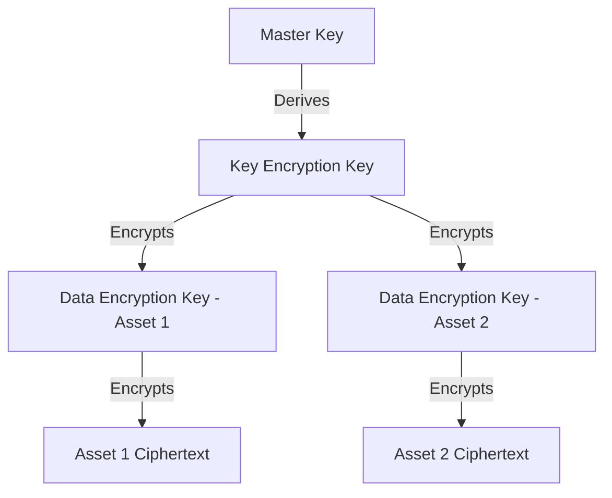
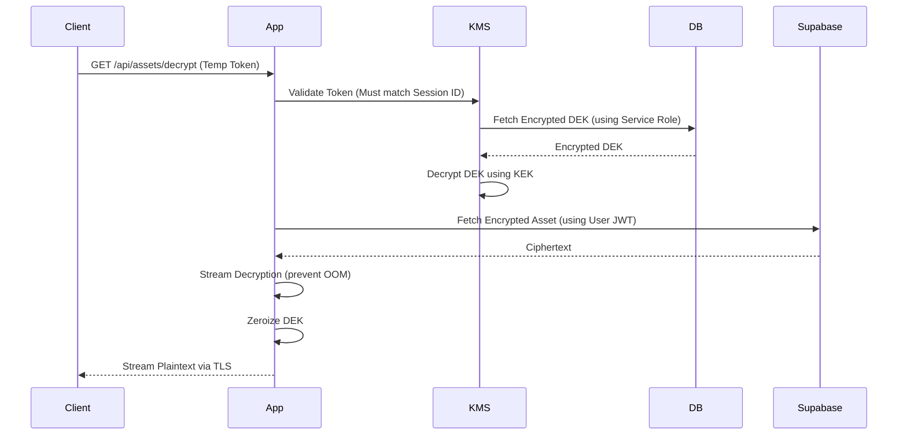

# SecureMax Security Model

## 1. Security Philosophy
SecureMax (SIH26125) is built upon a foundation of **Zero-Trust architecture**, **defense-in-depth**, and **fail-closed** design. 

The core operating principle of SecureMax is: **AUTHORIZATION ≠ DECRYPTION**. 
In traditional systems, if a user is authorized, they are implicitly granted the ability to read the file. In SecureMax, these are two separate steps across two separate boundaries. 
- **Authorization** means verifying identity and permissions (handled by Chain-1).
- **Decryption** means obtaining the specific, ephemeral key material required to read the ciphertext (handled by Chain-2 and the Key Management System).
An attacker who bypasses the authorization layer still cannot read the data because they lack the cryptographic material.

## 2. Trust Boundaries

```mermaid
flowchart TD
    subgraph Untrusted [Untrusted Zone]
        Client[Browser / Client App]
    end

    subgraph TrustedCompute [Trusted Compute Zone (Vercel)]
        App[Next.js Serverless API]
        KMS[Software KMS Module]
    end

    subgraph TrustedStorage [Trusted Storage Zone (Supabase)]
        DB[(PostgreSQL Database)]
        Storage[(Encrypted Asset Storage)]
    end

    subgraph Trustless [Trustless Verification Zone (Blockchain)]
        Chain1[Chain-1: Identity & RBAC]
        Chain2[Chain-2: Key Policy]
    end

    Client -- HTTPS --> App
    App -- Query --> DB
    App -- Retrieve Ciphertext --> Storage
    App -- Verify & Anchor --> Chain1
    App -- Verify Policy --> Chain2
    KMS -- Decrypt DEK --> DB
```

## 3. Identity & Authentication Model

- **DID Scheme:** SecureMax employs a simplified Decentralized Identifier (DID) scheme formatted as `did:securemax:<ethereum_address_lowercase>`.
- **Wallet Signature Authentication (SIWE):** Primary authentication utilizes wallet signatures. 
  - **Nonce Security [HARDENED]:** To prevent replay attacks (Threat Vector 26), the server generates a cryptographically secure random nonce, stores it in an HTTP-only cookie, and requires the signature to include this exact nonce. The nonce is destroyed immediately upon validation.
- **Session Management:** The server issues an HTTP-only session cookie containing a JWT upon successful signature verification. Sessions have a strict **1-hour expiration**, requiring re-signature or token refresh.
- **Session Binding:** Sessions are bound to specific device characteristics and IP addresses to prevent session hijacking.

## 4. Authorization Model

SecureMax uses a comprehensive Role-Based Access Control (RBAC) architecture with contextual evaluation.

- **Explicit Permission Checks:** Every action requires explicit permission verification.
- **RPC Lag Protection [HARDENED]:** To prevent stale authorization (Vector 13/14), API routes performing critical checks must query the RPC node with `blockTag: 'latest'` and strictly bypass all application-level caches (`no-store`).

## 5. Cryptographic Architecture



- **Algorithm:** AES-256-GCM. 256-bit key size, 12-byte random IV per operation, 16-byte authentication tag.
- **Associated Data (AAD):** Bound to `asset_id + key_version + timestamp` to prevent ciphertext swapping attacks.
- **Key Derivation:** The KEK is derived from the Master Key and a salt using HKDF.
- **Separation of Keys:** Identity/signing keys (wallet keys) are strictly separate from encryption keys (DEKs/KEKs).
- **Client Leakage Prevention [HARDENED]:** All crypto modules MUST utilize the `server-only` package to guarantee build failures if Next.js attempts to bundle cryptographic secrets into the browser (Vector 18).

## 6. Key Management System (KMS)



- **Temporary Decryption Token [HARDENED]:** A short-lived JWT (5-minute TTL) authorizing the release of a DEK. 
  - **Token Binding:** The token payload MUST include the user's `session_id`. If the token is stolen (Vector 15), it cannot be replayed outside of the authenticated HTTP session that requested it.
- **Key Lifecycle:** Generates a new DEK, re-encrypts the asset, increments the version. Old DEK enters `ROTATED` state.
- **Failure Mode:** If KMS fails, it fails closed. No decryption occurs.

## 7. Blockchain Security

SecureMax utilizes two separated blockchain domains to enforce the authorization ≠ decryption boundary.

- **Chain-1 Security:** Guarantees identity immutability, tracks role changes, and ensures asset provenance.
- **Chain-2 Security:** Enforces key policies and provides non-repudiation of cryptographic authorization events.
- **Zero-Trust Access Orchestrator**
  - **Principle**: `AUTHORIZATION ≠ DECRYPTION`.
  - **Implementation**: The API acts purely as an orchestrator. It demands strict consensus from three separate domains: Database (RLS), Chain-1 (Identity), and Chain-2 (Policy) before issuing a temporary, cryptographically bound 30-minute JWT token for KMS execution.
  - **Enforcement (Post-Hostile Audit)**: The KMS `executeDecryption` mechanism explicitly refuses execution unless a cryptographically valid `tempToken` is provided directly to the KMS layer, preventing architectural TOCTOU bypasses if an API route fails to check the token itself.

- **Edge Middleware & Server Actions**
  - **Principle**: Never trust client inputs or generic routing contexts.
  - **Implementation**: Next.js Server Actions (`runSecurityScanAction`, `fetchSecurityPosture`, `logTransaction`, `getDashboardMetrics`) are heavily protected. 
  - **Enforcement (Post-Hostile Audit)**: All server actions invoke `getVerifiedSession()` which cryptographically verifies the Next.js session cookie using `jose` at the Edge, throwing `Forbidden` if the payload is altered or lacks required roles (e.g., `ADMIN`). This decisively mitigates IDOR, Privilege Escalation, and arbitrary blockchain transaction injection.

## 8. Audit Trail Security

- **Hash Chain Specification:** Every audit event includes a `prev_hash` (SHA-256 of the previous event's JSON), forming a local, tamper-evident chain.
- **Merkle Tree Anchoring:** Batches of events (e.g., every 100 events) are processed into a Merkle tree. The Merkle root is anchored to the Chain-1 `AuditAnchor` contract.
- **Tamper Detection:** API endpoints can recalculate the hash chain and compare the computed Merkle root against the blockchain anchor.

## 9. Sentinel Security System

- **Sandbox Isolation:** Operates on an isolated set of test users and assets within the database.
- **Deterministic Validation:** Sentinel relies on deterministic code execution. **It does NOT use AI to provide security guarantees** (Vector 30).
- **Automated Response:** Maps severity to actions: `LOG`, `ALERT`, `RESTRICT`, `FREEZE`.

## 10. Data Protection

- **Data Classification:** `PUBLIC` < `INTERNAL` < `CONFIDENTIAL` < `RESTRICTED` < `HIGH`
- **Encryption at Rest:** Application-layer AES-256-GCM encryption before being stored in Supabase Storage.
- **Database IDOR Prevention [HARDENED]:** The API must instantiate Supabase clients using the authenticated user's JWT to propagate Row-Level Security (RLS) to the database. The `SUPABASE_SERVICE_ROLE_KEY` is strictly quarantined to the KMS module for fetching DEKs (Vectors 6, 20, 21).

## 11. Failure Modes & Security Responses

| Failure | System Behavior | Security Action |
|---|---|---|
| Blockchain RPC Unavailable | Fail Closed (503) | Reject access, log `RPC_TIMEOUT`. Do NOT fall back to cache. |
| Supabase Database Down | Fail Closed (503) | Reject access, log `DB_UNAVAILABLE` |
| KMS Master Key Missing | Server refusing to start | Admin alert, halt execution |
| Memory Limit Exceeded | Stream Abort | Protect against Vercel OOM DoS via stream piping |
| Expired Temporary Token | Reject Decryption | Log `ACCESS_EXPIRED`, alert user |
| Token Binding Mismatch | Reject Decryption | Log `TOKEN_HIJACK_ATTEMPT`, revoke session |
| Hash Chain Discrepancy | Alert & Flag | Trigger immediate admin investigation |

## 12. Prototype Security Limitations (Honest Compromises)

> [!WARNING]
> The SIH26125 prototype includes specific limitations for feasibility.
- **Software KMS:** Uses a server-side TypeScript KMS. Production requires an HSM-backed KMS (e.g., AWS KMS, HashiCorp Vault).
- **Shared Testnet:** Both Chain-1 and Chain-2 operate on the Sepolia testnet in separate namespaces. Production demands physically distinct networks or dedicated app-chains.
- **No Hardware Attestation:** Lacks FIDO2/WebAuthn hardware-bound identity verification.
- **No WAF/DDoS Protection:** Vercel's standard tier is used without enterprise WAF configurations.
- **Sandbox Database Sharing:** The Sentinel sandbox shares the main PostgreSQL instance (partitioned by flag) rather than using a physically separate database.
