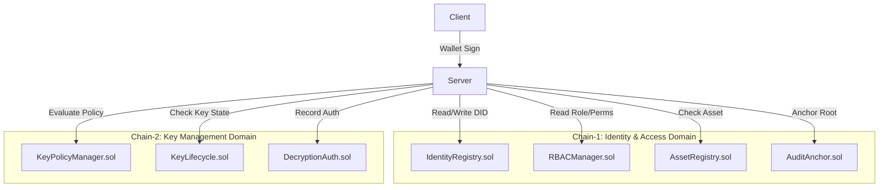

# SecureMesh Smart Contract Architecture

## Overview
SecureMesh employs a **dual-domain architecture** separating Identity/Access from Key Management. 
**Why two logical chains?** This separation minimizes systemic risk. The Identity/Access domain manages who you are and what you can request. The Key Management domain manages cryptographic authorizations. An exploit in one domain does not immediately compromise the other, as the KMS requires valid proofs from both to release a decryption key.
**Prototype Compromise:** For the SIH prototype realism and ease of Vercel deployment, both contract sets are deployed to the *same* EVM testnet (e.g., Sepolia). However, they use completely separate contract namespaces, deployer accounts, and ABI surfaces to emulate the architectural separation. In a production environment, these would be on physically separate networks or isolated L2s.

## Architecture Diagram


## Contract Domain Separation
Identity and access logic dictate business rules ("Alice is an engineer and can read Asset X"). Key management dictates cryptographic rules ("Key Y is active, not revoked, and valid under Policy Z"). Keeping them separate means the KMS relies on a distinct trust anchor for the DEK release, significantly increasing the difficulty of unauthorized data access.

## Chain-1: Identity & Access Domain

### `IdentityRegistry.sol`
- **Purpose:** Manages the lifecycle of user DIDs.
- **Inheritance:** `Ownable`, `Pausable` (from OpenZeppelin)
- **Structs:**
  ```solidity
  struct Identity {
      address owner;
      string did;
      bytes32 nameHash;
      uint8 role;
      uint8 status;
      uint256 registeredAt;
      uint256 updatedAt;
  }
  ```
- **Enums:** `enum IdentityStatus { Unregistered, Active, Suspended, Revoked }`
- **State variables/Mappings:** `mapping(string => Identity) public identities;`
- **Functions:** 
  - `function registerIdentity(address owner, string memory did, bytes32 nameHash, uint8 role) external onlyOwner`
  - `function updateStatus(string memory did, uint8 status) external onlyOwner`
  - `function updateRole(string memory did, uint8 role) external onlyOwner`
  - `function getIdentity(string memory did) external view returns (Identity memory)`
  - `function isActive(string memory did) external view returns (bool)`
- **Events:** `IdentityRegistered`, `IdentityStatusChanged`, `RoleUpdated`
- **Access Control:** `onlyOwner` applied for admin functions.

### `RBACManager.sol`
- **Purpose:** Manages role definitions and user assignments.
- **Structs:**
  ```solidity
  struct RoleAssignment {
      string did;
      uint8 role;
      uint256 assignedAt;
      bool isActive;
  }
  ```
- **Functions:** 
  - `function assignRole(string memory did, uint8 role) external`
  - `function revokeRole(string memory did) external`
  - `function hasPermission(string memory did, uint8 requiredPermission) external view returns (bool)`
  - `function getRole(string memory did) external view returns (RoleAssignment memory)`
- **Events:** `RoleAssigned`, `RoleRevoked`
- **Permission encoding:** Uses a bitfield approach (e.g., checking if a particular bit is set in `uint256 permissions`) to allow for gas-efficient storage and validation.

### `AssetRegistry.sol`
- **Purpose:** On-chain registry of asset metadata and user assignments.
- **Structs:**
  ```solidity
  struct Asset {
      bytes32 assetId;
      string assetCode;
      bytes32 contentHash;
      uint8 classification;
      string ownerDid;
      uint8 status;
      uint256 registeredAt;
  }
  
  struct Assignment {
      bytes32 assetId;
      string assigneeDid;
      uint8 permissions;
      bool isActive;
      uint256 assignedAt;
      uint256 revokedAt;
  }
  ```
- **Functions:** 
  - `function registerAsset(bytes32 assetId, string memory assetCode, bytes32 contentHash, uint8 classification, string memory ownerDid) external`
  - `function assignAsset(bytes32 assetId, string memory assigneeDid, uint8 permissions) external`
  - `function revokeAssignment(bytes32 assetId, string memory assigneeDid) external`
  - `function transferOwnership(bytes32 assetId, string memory newOwnerDid) external`
  - `function getAsset(bytes32 assetId) external view returns (Asset memory)`
  - `function getAssignment(bytes32 assetId, string memory assigneeDid) external view returns (Assignment memory)`
  - `function isAssigned(bytes32 assetId, string memory assigneeDid) external view returns (bool)`
- **Events:** `AssetRegistered`, `AssetAssigned`, `AssignmentRevoked`, `OwnershipTransferred`

### `AuditAnchor.sol`
- **Purpose:** Anchors Merkle roots of audit events for a tamper-evident audit trail.
- **Structs:**
  ```solidity
  struct Anchor {
      uint256 batchStartId;
      uint256 batchEndId;
      bytes32 merkleRoot;
      uint256 anchoredAt;
  }
  ```
- **Functions:** 
  - `function anchorMerkleRoot(uint256 batchStartId, uint256 batchEndId, bytes32 merkleRoot) external`
  - `function getAnchor(uint256 batchStartId) external view returns (Anchor memory)`
  - `function getLatestAnchor() external view returns (Anchor memory)`
- **Events:** `MerkleRootAnchored`

## Chain-2: Key Management Domain

### `KeyPolicyManager.sol`
- **Purpose:** Manages the conditions under which a key can be used.
- **Structs:**
  ```solidity
  struct KeyPolicy {
      bytes32 policyId;
      bytes32 keyId;
      uint8 policyType;
      bytes32 conditionsHash;
      bool isActive;
      uint256 createdAt;
  }
  ```
- **Functions:** 
  - `function createPolicy(bytes32 policyId, bytes32 keyId, uint8 policyType, bytes32 conditionsHash) external`
  - `function updatePolicy(bytes32 policyId, bytes32 conditionsHash) external`
  - `function deactivatePolicy(bytes32 policyId) external`
  - `function evaluatePolicy(bytes32 policyId, bytes32 contextHash) external view returns (bool)`
  - `function getPolicy(bytes32 policyId) external view returns (KeyPolicy memory)`
- **Events:** `PolicyCreated`, `PolicyUpdated`, `PolicyDeactivated`

### `KeyLifecycle.sol`
- **Purpose:** Tracks key metadata. **CRITICAL:** Stores identifiers and status ONLY, never actual key material.
- **Structs:**
  ```solidity
  struct KeyMetadata {
      bytes32 keyId;
      bytes32 assetId;
      uint256 version;
      uint8 status;
      uint8 algorithm;
      uint256 createdAt;
      uint256 rotatedAt;
      uint256 revokedAt;
  }
  ```
- **Functions:** 
  - `function registerKey(bytes32 keyId, bytes32 assetId, uint256 version, uint8 algorithm) external`
  - `function rotateKey(bytes32 oldKeyId, bytes32 newKeyId, uint256 newVersion) external`
  - `function revokeKey(bytes32 keyId) external`
  - `function getKeyMetadata(bytes32 keyId) external view returns (KeyMetadata memory)`
  - `function isKeyActive(bytes32 keyId) external view returns (bool)`
- **Events:** `KeyRegistered`, `KeyRotated`, `KeyRevoked`

### `DecryptionAuth.sol`
- **Purpose:** Records decryption authorization events for non-repudiation.
- **Structs:**
  ```solidity
  struct AuthorizationRecord {
      bytes32 authId;
      string userDid;
      bytes32 assetId;
      bytes32 keyId;
      uint8 result;
      uint256 timestamp;
      uint256 expiresAt;
  }
  ```
- **Functions:** 
  - `function recordAuthorization(bytes32 authId, string memory userDid, bytes32 assetId, bytes32 keyId, uint256 expiresAt) external`
  - `function recordCompletion(bytes32 authId) external`
  - `function recordDenial(bytes32 authId, string memory userDid, bytes32 assetId, string memory reason) external`
  - `function getAuthorization(bytes32 authId) external view returns (AuthorizationRecord memory)`
- **Events:** `DecryptionAuthorized`, `DecryptionCompleted`, `DecryptionDenied`

## Additional Architecture Details

### Shared Interfaces
- **`ISecureMesh.sol`**: Contains shared structs, enums, and external methods to prevent duplication across contracts and standardize types (e.g. standardizing user roles, classifications, key algorithms).

### Gas Optimization Notes
- Use `uint256` for operations when possible; where struct packing is utilized (e.g., grouping `uint8` variables together like `role` and `status` in `Identity`), do so intentionally.
- Utilize `bytes32` for hashes and IDs instead of `string` where variable length is unnecessary, saving overhead.
- Mapping-based bitfields in `RBACManager` are prioritized over array iterations.

### Security Considerations
- **Reentrancy:** Incorporate `ReentrancyGuard` from OpenZeppelin on all state-mutating functions.
- **Access Control:** Strict `onlyOwner` or designated role modifiers on write functions (especially in the Chain-1 environment).
- **Integer Overflow:** Safe inherently since solidity ^0.8.0 has built-in overflow/underflow checks.
- **Event Ordering:** Rely on strict event emission patterns to ensure reliable monitoring by off-chain indexers.

### Deployment Order & Dependencies
1. Shared Libraries/Interfaces (`ISecureMesh.sol`)
2. `IdentityRegistry.sol`
3. `RBACManager.sol`
4. `AssetRegistry.sol`
5. `AuditAnchor.sol`
6. Chain-2 Contracts independently: `KeyPolicyManager.sol`, `KeyLifecycle.sol`, `DecryptionAuth.sol`

### Hardhat Configuration
- **Networks:** Configured for `localhost` (testing) and `sepolia` (prototype deployment).
- **Compiler:** Solidity `0.8.24` with the optimizer enabled (runs: 200).
- **Test Setup:** Uses Hardhat Toolbox with Mocha/Chai for execution and verification.

### Test Coverage Plan
- 100% coverage required on Access Control boundaries and state mutations.
- Rigorous edge case testing for revocation loops, identity suspensions, and evaluations of inactive key references.

### Upgrade Strategy
- For prototype simplicity, contracts are **not upgradeable**. A note is made here that for a production-grade deployment, an upgradeable pattern (e.g., UUPS or Transparent Proxy via OpenZeppelin) is strictly required to address vulnerabilities or add features post-deployment.
