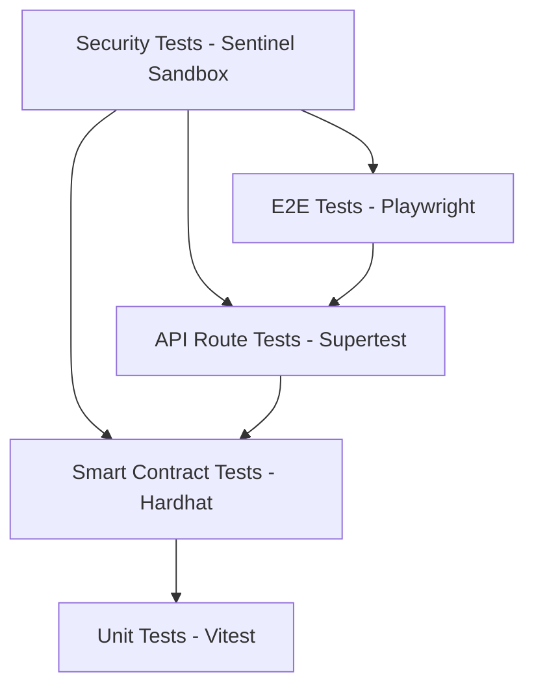

# SecureMax Testing Strategy

This document outlines the testing methodology, infrastructure, and explicit security verification cases for the SecureMax (SIH26125) platform.

## 1. Testing Philosophy
- **Security-First Verification**: Testing validates not just that the system works when used correctly, but that it robustly *fails closed* when used incorrectly, maliciously, or when dependencies fail.
- **Fail-Closed Guarantees**: A major focus of our testing is asserting that any failure in authorization, blockchain state, or KMS access results in an explicit denial of access.
- **No False Positives in Security**: Security tests are deterministic. They verify precise architectural boundaries (e.g. cross-role isolation, key expiry enforcement).

## 2. Testing Pyramid

## 3. Test Infrastructure
- **Vitest**: Fast, Vite-native testing framework for `lib/` utilities and unit tests.
- **Hardhat**: Ethereum development environment for compiling, deploying, and testing Chain-1 and Chain-2 smart contracts (using Chai matchers).
- **Playwright**: End-to-end browser testing for critical user workflows.
- **Supertest**: HTTP assertion library for testing Next.js API routes without full browser overhead.

## 4. Unit Tests (`lib/`)
Focuses on pure functions, cryptographic utilities, and localized business logic.

- **`lib/crypto`**: 
  - AES-256-GCM encrypt/decrypt roundtrip validation.
  - Rejection of invalid keys or tampered ciphertext.
  - Guarantee of IV uniqueness per encryption.
  - Associated Authenticated Data (AAD) integrity checks.
- **`lib/kms`**:
  - Envelope encryption/decryption flows.
  - Key rotation and revocation logic.
  - Temporary token generation, validation, and strict expiry enforcement.
  - Assertion that a missing Master Key throws a fatal error (fail closed).
- **`lib/auth`**:
  - Wallet signature (SIWE) verification.
  - JWT session token creation, validation, and expiration.
  - RBAC permission evaluation logic.
- **`lib/audit`**:
  - Deterministic event hash computation.
  - Hash chain integrity validation (detecting tampering).
  - Merkle tree computation for blockchain anchoring.
- **`lib/sentinel`**:
  - Validation of the isolated test runner logic itself.

## 5. Smart Contract Tests (Hardhat)
Validates all on-chain logic, access controls, and state transitions using local Hardhat networks.

- **IdentityRegistry**: Registration, duplicate DID rejection, status transitions, role updates, rejection of unauthorized access.
- **RBACManager**: Role assignment, revocation, permission checks, prevention of unauthorized role manipulation.
- **AssetRegistry**: Asset registration, assignment, revocation, transfer, double-assignment prevention.
- **AuditAnchor**: Anchoring of merkle roots, retrieval, sequential batch ID enforcement.
- **KeyPolicyManager**: Policy creation, evaluation, deactivation.
- **KeyLifecycle**: Key metadata registration, rotation tracking, revocation enforcement, status queries.
- **DecryptionAuth**: Recording authorization success/denials.
- **Cross-Contract Boundaries**: Ensuring Chain-1 and Chain-2 contracts remain completely logically isolated (no direct cross-chain contract calls).

## 6. API Route Tests
Tests the integration of middleware, route handlers, and database interactions.

- **Auth Flows**: Successful login, invalid signature rejection, session expiry.
- **Access Request Flow**: Happy path (approval -> temp token), plus all failure modes (inactive DID, revoked asset, failed policy eval).
- **Asset Operations**: Upload/encrypt and decrypt roundtrips via the API.
- **RBAC Enforcement**: Asserting each defined role can only access its permitted endpoints.
- **Fail-Closed Verification**: Simulating unavailable blockchain RPCs or unavailable KMS to ensure 503 errors and no data leakage.
- **Rate Limiting**: Verifying standard and strict rate limits trigger 429 responses.
- **Input Validation**: Sending malformed JSON payloads to verify 400 Validation Error responses via Zod.

## 7. E2E Tests (Playwright)
Validates the full user journey across the frontend, backend, and blockchain mock state.

- **Admin Journey**: Create user, assign roles, register assets, view system metrics.
- **Engineer Journey**: Request access to an asset, receive temporary token, decrypt and view asset, verify access expires after 5 minutes.
- **Auditor Journey**: Browse audit trail, manually verify hash chain integrity, export logs.
- **Security Analyst Journey**: Run manual Sentinel scan, review findings, update status.
- **Cross-Role Isolation**: Verify an Auditor cannot decrypt assets, and an Engineer cannot manage system keys.

## 8. Security Tests (Sentinel Sandbox)
The internal Sentinel test runner runs deterministic attack scenarios against an isolated sandbox database state.

| Test ID | Name | Category | Description | Expected Result |
|---|---|---|---|---|
| `SEC-001` | Privilege Escalation | Authorization | Attempt to assign ADMIN role as an ENGINEER. | DENIED (403) |
| `SEC-002` | Expired Token Reuse | Authentication | Attempt to use an expired KMS temp token for decryption. | DENIED (403) |
| `SEC-003` | Revoked Permission Access | Authorization | Attempt to request access to an asset after assignment is revoked. | DENIED (403) |
| `SEC-004` | Cross-Role Boundary | Authorization | AUDITOR attempts to call the decrypt endpoint. | DENIED (403) |
| `SEC-005` | Key Policy Bypass | KMS | Request decryption without Chain-2 authorization logged. | DENIED (403) |
| `SEC-006` | Ownership Manipulation | Asset Management | Attempt to transfer asset ownership without being the owner/admin. | DENIED (403) |
| `SEC-007` | Audit Chain Tampering | Audit | Directly modify an audit event in DB; verify hash chain check fails. | DETECTED (Integrity Alert) |
| `SEC-008` | Invalid State Transition | Key Management | Attempt to revoke a key that is already revoked. | ERROR (400) |
| `SEC-009` | Session Hijacking | Authentication | Use valid session token from a mismatched IP address (if IP policy enabled). | DENIED (403) |
| `SEC-010` | KMS Bypass | KMS | Attempt to call the internal decrypt routine directly bypassing temp token check. | DENIED (403) |

## 9. Coverage Requirements
To maintain high assurance, the project enforces strict coverage minimums:
- **`lib/`**: > 80% coverage.
- **`contracts/`**: > 90% coverage (statement and branch).
- **API Routes**: > 70% coverage.
- **Critical Paths**: 100% coverage (Specifically: the Access Request flow, Decryption flows, Auth middleware).

## 10. CI Integration
- **GitHub Actions Workflow**: Runs automatically on Pull Requests to `main`.
- **Test Matrix**: Node.js 18+ environments, executing against a local Hardhat node spun up within the CI runner.
- **Artifacts**: CI publishes test results and coverage reports (lcov/HTML) as workflow artifacts. PRs failing coverage thresholds are automatically blocked.
