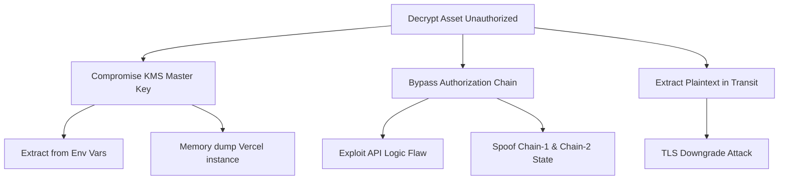
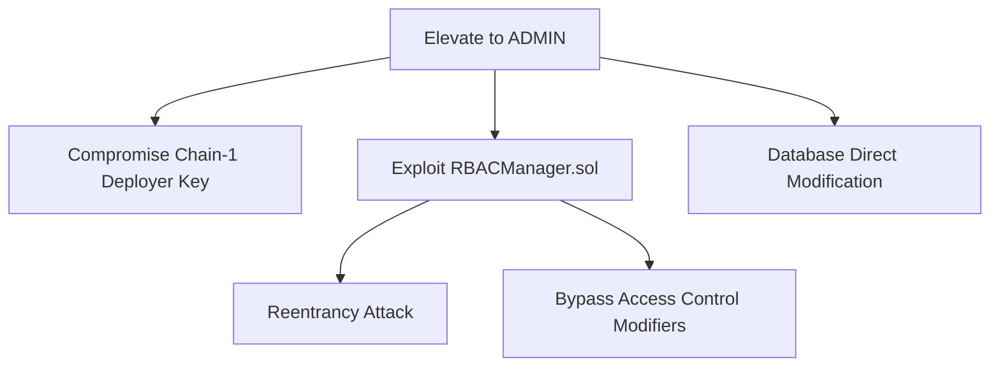
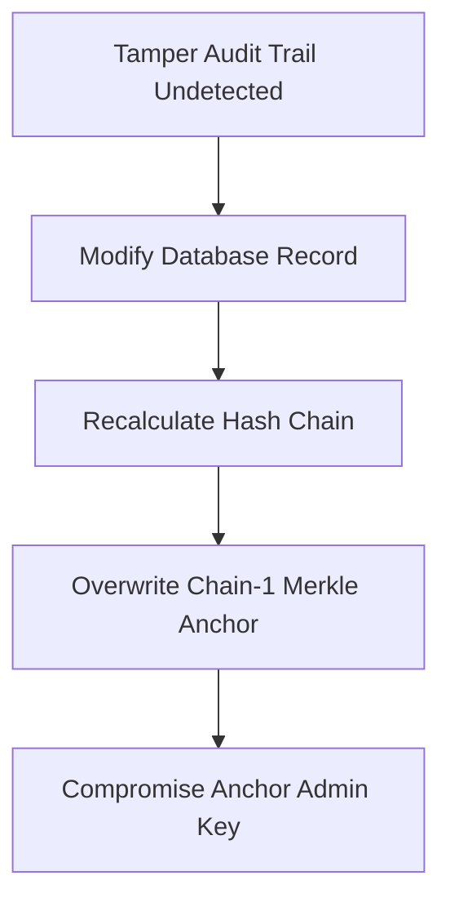
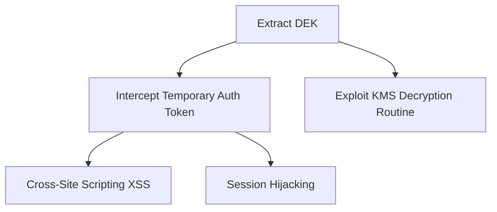

# SecureMesh Threat Model

## 1. Threat Modeling Methodology
This threat model utilizes the **STRIDE** methodology (Spoofing, Tampering, Repudiation, Information Disclosure, Denial of Service, Elevation of Privilege) combined with targeted **Attack Trees** to systematically identify and mitigate risks within the SecureMesh architecture.

## 2. System Boundary & Attack Surface

```mermaid
flowchart TD
    ExternalAttacker([External Attacker])
    MaliciousInsider([Malicious Insider])
    CompromisedNode([Compromised RPC Node])
    
    subgraph AttackSurface [Attack Surface]
        NextAPI[Next.js API Routes]
        SupabaseEndpoint[Supabase Endpoints]
        SmartContracts[Smart Contracts (Sepolia)]
    end
    
    ExternalAttacker --> NextAPI
    ExternalAttacker --> SmartContracts
    MaliciousInsider --> SupabaseEndpoint
    CompromisedNode -.-> SmartContracts
```

## 3. Threat Actors

- **Nation-State / APT:** High capability, high resources. Targeting encrypted highly-classified assets (e.g., Radar specs).
- **Insider Threat (Curious Admin):** Authorized access to database, but attempting to read ciphertext without authorization.
- **External Attacker:** Attempting to exploit API vulnerabilities, session hijacking, or smart contract bugs.
- **Compromised RPC Node:** Attempting to spoof blockchain state to trick the backend into granting authorization.

## 4. STRIDE Analysis

| ID | Threat | Category | Affected Component | Likelihood | Impact | Risk | Mitigation | Residual Risk |
|---|---|---|---|---|---|---|---|---|
| TM-01 | DID Impersonation | Spoofing | API Auth | Low | High | Medium | Wallet signature (SIWE) | Low |
| TM-02 | Session Hijacking | Spoofing | Client/API | Medium | High | High | HTTP-only cookies, 1h expiry, IP/Device binding | Low |
| TM-03 | Wallet Theft | Spoofing | Client | Medium | Critical | High | N/A (Outside system boundary) | Medium |
| TM-04 | Replay Attacks | Spoofing | Next.js API | Low | Medium | Low | Nonce in temporary auth tokens | Low |
| TM-05 | Asset Modification | Tampering | Supabase Storage | Low | High | Medium | AES-GCM Auth tag validation | Low |
| TM-06 | Audit Log Tampering | Tampering | Database | Medium | High | High | Hash chaining + Merkle anchoring to Chain-1 | Low |
| TM-07 | Smart Contract State Manipulation | Tampering | Chain-1 / Chain-2 | Low | Critical | Medium | OpenZeppelin access controls, Sepolia security | Low |
| TM-08 | Encrypted Content Alteration | Tampering | Supabase Storage | Low | Medium | Low | AES-256-GCM authenticated encryption | Low |
| TM-09 | Denial of Access Events | Repudiation | Database | Low | Medium | Low | Hash chain immutability | Low |
| TM-10 | Denial of Key Usage | Repudiation | KMS | Low | High | Medium | Chain-2 immutable logging of auth events | Low |
| TM-11 | Key Material Exposure | Info Disclosure | KMS / API | Low | Critical | High | Ephemeral DEKs zeroized in memory | Medium (Software KMS) |
| TM-12 | Plaintext Leakage | Info Disclosure | API | Low | Critical | High | Plaintext streamed via TLS, never stored | Low |
| TM-13 | Metadata Analysis | Info Disclosure | Database | High | Low | Low | Generic IDs, limited context exposure | Low |
| TM-14 | Side-Channel Attacks | Info Disclosure | Vercel Environment | Low | High | Low | Standard Vercel isolation | Low |
| TM-15 | Blockchain Congestion | DoS | Chain-1 / Chain-2 | High | Medium | Medium | Fail-closed design prevents unauthorized access | Medium |
| TM-16 | KMS Exhaustion | DoS | KMS | Medium | High | High | Rate limiting on API routes | Low |
| TM-17 | API Rate Abuse | DoS | Next.js API | Medium | Medium | Medium | Vercel edge rate limits | Low |
| TM-18 | Storage Exhaustion | DoS | Supabase | Medium | Medium | Medium | File size limits, strict auth on upload | Low |
| TM-19 | Role Escalation | Elevation | RBACManager.sol | Low | Critical | Medium | Strict Chain-1 admin modifiers | Low |
| TM-20 | Unauthorized Key Access | Elevation | KeyPolicyManager.sol | Low | Critical | Medium | Dual-chain verification, separation of duties | Low |
| TM-21 | Cross-Chain Bypass | Elevation | App Logic | Low | Critical | High | Strict backend checks requiring BOTH chains | Low |
| TM-22 | Admin Impersonation | Elevation | API | Low | High | Medium | Strong auth, RBAC checks | Low |

## 5. Attack Trees

### Attack Tree 1: Unauthorized Asset Decryption


### Attack Tree 2: Privilege Escalation to ADMIN


### Attack Tree 3: Audit Trail Tampering


### Attack Tree 4: Key Material Extraction


## 6. Cross-Chain Boundary Threats
Because SecureMesh utilizes two chains, an attacker must compromise the state of both to achieve unauthorized decryption.
- **Threat:** Malicious RPC node returning spoofed Chain-1 state (saying user has ADMIN).
- **Mitigation:** The application ALSO queries Chain-2 for the Key Policy. If Chain-2 has no matching authorization event triggered by a valid Chain-1 state, the KMS denies the key.

## 7. Insider Threat Scenarios
- **Compromised Database Admin:** Can view encrypted blobs and metadata, but lacks the KMS Master Key to derive the KEK and DEK.
- **Rogue Security Analyst:** Has high visibility but lacks the `decrypt_assets` permission. Bypassing this requires compromising the RBAC contract.

## 8. Supply Chain Threats
- **Dependency Compromise:** Next.js or Cryptographic library dependencies compromised. Mitigated by `npm audit` and static versions.
- **Environment Variable Leakage:** Master key exposed in GitHub. Mitigated by strict secret management and never committing `.env`.

## 9. Sentinel Test Coverage Mapping
Sentinel directly tests mitigations for critical threats:
- Tests TM-02 (Session Hijacking): Attempts to replay expired tokens.
- Tests TM-19 (Role Escalation): Attempts admin actions from standard user accounts.
- Tests TM-21 (Cross-Chain Bypass): Attempts to request keys without Chain-1 auth.

## 10. Risk Heat Map

| Likelihood \ Impact | Low | Medium | High | Critical |
|---|---|---|---|---|
| **High** | TM-13 | TM-15 | | |
| **Medium** | | TM-17, TM-18 | TM-02, TM-06, TM-16 | TM-03 |
| **Low** | TM-09, TM-14 | TM-04, TM-08 | TM-01, TM-05, TM-10, TM-22 | TM-07, TM-11, TM-12, TM-19, TM-20, TM-21 |

## 11. Residual Risk Acceptance (Prototype Level)
> [!NOTE]
> The following risks are accepted for the SIH26125 prototype:
- **Software KMS Extracation (TM-11):** We accept the risk that a memory dump of the Vercel instance could expose the Master Key, as we cannot procure an HSM for the prototype.
- **Wallet Theft (TM-03):** We rely on user operational security for their private keys.

## 12. Recommended Production Mitigations
1. **Hardware Security Module (HSM):** Migrate KMS from software to FIPS 140-2 Level 3 HSM.
2. **Private Consortium Chain / L2:** Move off public Sepolia testnet to ensure privacy and SLA guarantees.
3. **SOC Team Integration:** Forward audit events to a SIEM.
4. **Formal Verification:** Formally verify Chain-1 and Chain-2 smart contracts.
5. **Penetration Testing:** Engage external third-party security auditors.
